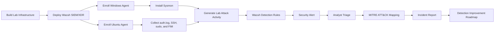
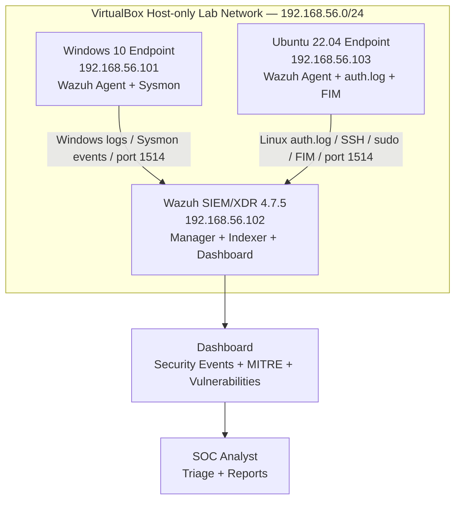
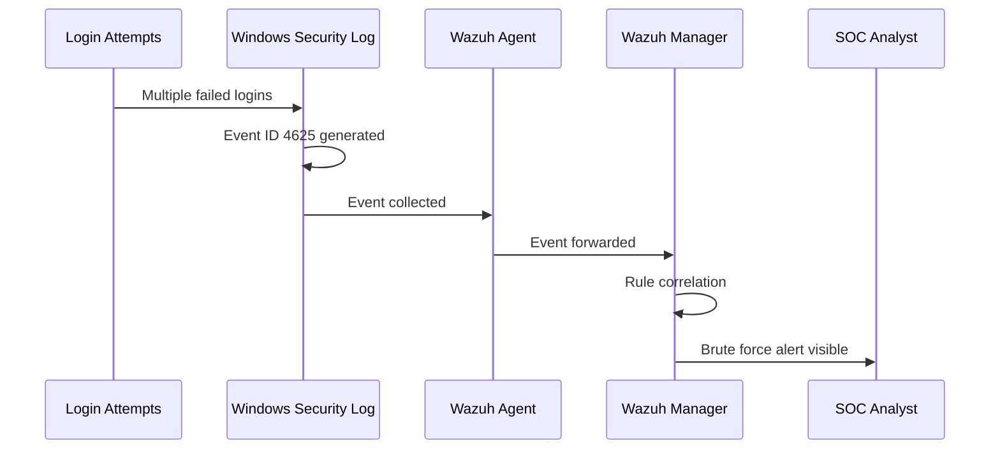
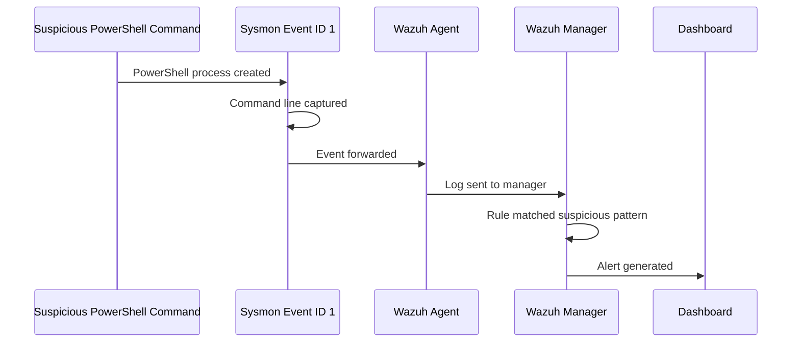
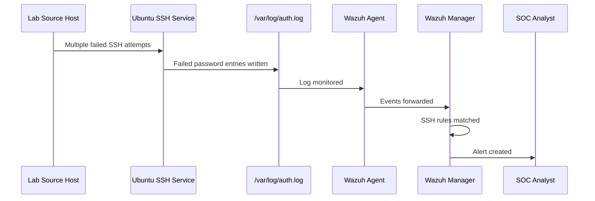
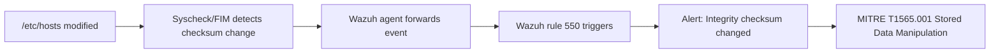
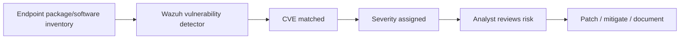

<!--
Professional README for:
Enterprise SOC Lab — Wazuh SIEM/XDR with MITRE ATT&CK Detection

No dropdown version:
- No <details> tags
- No collapsible sections
- Everything is visible directly in the README
-->

<div align="center">

# 🛡️ Enterprise SOC Lab  
### Wazuh SIEM/XDR • MITRE ATT&CK • Windows Sysmon • Linux Detection • Incident Response


<br>


<br>


<br>

### Real endpoint activity. Real Wazuh alerts. Real analyst workflow.

**Build → Configure → Generate Logs → Detect → Investigate → Map to MITRE → Report → Improve**

</div>

---

## 📌 Table of Contents

- [Executive Summary](#-executive-summary)
- [Why This Project Matters](#-why-this-project-matters)
- [SOC Workflow Demonstrated](#-soc-workflow-demonstrated)
- [Lab Architecture](#-lab-architecture)
- [Technology Stack](#-technology-stack)
- [Detection Summary](#-detection-summary)
- [MITRE ATT&CK Mapping](#-mitre-attck-mapping)
- [Attack Simulation Deep Dive](#-attack-simulation-deep-dive)
- [Evidence Gallery](#-evidence-gallery)
- [Incident Reports](#-incident-reports)
- [Detection Engineering](#-detection-engineering)
- [Vulnerability Detection](#-vulnerability-detection)
- [How to Reproduce This Lab](#-how-to-reproduce-this-lab)
- [Skills Demonstrated](#-skills-demonstrated)
- [Problems Solved](#-problems-solved)
- [Future Improvements](#-future-improvements)
- [Ethical Notice](#-ethical-notice)
- [Resume Bullet](#-resume-bullet)

---

# 🔎 Executive Summary

This repository contains a fully documented **Enterprise SOC Lab** built using **Wazuh SIEM/XDR**, a **Windows 10 endpoint with Sysmon**, and an **Ubuntu 22.04 endpoint**.

The lab simulates real-world attacker behaviors inside an isolated VirtualBox host-only network and shows how a SOC analyst detects, investigates, maps, and reports security events.

This project includes:

- Wazuh SIEM/XDR deployment
- Windows endpoint monitoring with Sysmon
- Ubuntu Linux endpoint monitoring
- File Integrity Monitoring
- Vulnerability Detection
- 6 simulated attack/detection scenarios
- MITRE ATT&CK mapping
- Formal incident response reports
- Evidence screenshots
- Future detection engineering roadmap

---

# 🎯 Why This Project Matters

This project demonstrates the real workflow of a junior SOC analyst: collecting endpoint logs, identifying suspicious activity, validating alerts, mapping detections to MITRE ATT&CK, and documenting the investigation.

| SOC Responsibility | How This Lab Demonstrates It |
|---|---|
| SIEM monitoring | Wazuh dashboard used for alert review |
| Endpoint visibility | Windows 10 + Sysmon and Ubuntu monitored with Wazuh agents |
| Alert triage | Rule ID, severity, host, time, source, and raw log reviewed |
| Threat detection | Brute force, PowerShell, account creation, SSH, FIM, and sudo activity detected |
| MITRE mapping | Each detection mapped to ATT&CK behavior |
| Incident documentation | 6 incident reports and a full SOC triage report created |
| Detection improvement | Future roadmap includes custom rules, Kali VM, auditd, Active Response, and alerting |

---

# 🔄 SOC Workflow Demonstrated



---

# 🏗️ Lab Architecture

## Current Lab Network


| System | Operating System | IP Address | Purpose |
|---|---|---:|---|
| Wazuh Server | Ubuntu Server | `192.168.56.102` | Manager, Indexer, Dashboard, alert engine |
| Windows Endpoint | Windows 10 Pro | `192.168.56.101` | Windows Event Logs, Sysmon, PowerShell activity |
| Linux Endpoint | Ubuntu 22.04.5 LTS | `192.168.56.103` | SSH logs, sudo logs, authentication logs, FIM |
| Network | VirtualBox Host-only | `192.168.56.0/24` | Isolated lab environment |

## Data Flow



---

# 🧰 Technology Stack

| Category | Tool / Technology | Purpose |
|---|---|---|
| SIEM / XDR | Wazuh 4.7.5 | Centralized detection, alerting, log analysis |
| Dashboard | Wazuh Dashboard / OpenSearch | Visual alert review and investigation |
| Windows Endpoint | Windows 10 Pro | Windows attack simulation and event collection |
| Linux Endpoint | Ubuntu 22.04.5 LTS | SSH, sudo, auth log, and FIM monitoring |
| Windows Telemetry | Sysmon | Process-level visibility |
| Linux Logs | `/var/log/auth.log` | SSH, sudo, PAM authentication events |
| FIM | Wazuh Syscheck | File Integrity Monitoring |
| Vulnerability Detection | Wazuh Vulnerability Detector | CVE visibility |
| Framework | MITRE ATT&CK Enterprise | Threat behavior mapping |
| Virtualization | VirtualBox | Isolated lab environment |
| Documentation | Markdown + PDF Reports | Portfolio-ready evidence and reports |

---

# 🚨 Detection Summary

| # | Scenario | Platform | Log Source | Wazuh Detection | MITRE Technique | Status |
|---|---|---|---|---|---|---|
| 01 | Windows failed login brute force | Windows | Windows Security Event Log | Failed authentication alerts | T1110.001 | ✅ Detected |
| 02 | Suspicious PowerShell execution | Windows | Sysmon + PowerShell logs | Encoded command / suspicious execution | T1059.001 | ✅ Detected |
| 03 | New local user creation | Windows | Windows Security Event Log | Account creation alert | T1136.001 | ✅ Detected |
| 04 | Linux SSH brute force | Ubuntu | `/var/log/auth.log` | SSH authentication failure alerts | T1110.001 | ✅ Detected |
| 05 | `/etc/hosts` file modification | Ubuntu | Wazuh FIM / Syscheck | File checksum changed | T1565.001 | ✅ Detected |
| 06 | sudo privilege escalation | Ubuntu | `/var/log/auth.log` | Successful and failed sudo alerts | T1548.003 | ✅ Detected |
| 07 | Vulnerability detection | Windows + Ubuntu | Wazuh Vulnerability Detector | CVE exposure visibility | N/A | ✅ Detected |

---

# 🧠 MITRE ATT&CK Mapping

| Detection | Log Source | MITRE ID | Technique | Tactic | Severity |
|---|---|---|---|---|---|
| Windows failed logins | Windows Security Log | T1110.001 | Brute Force: Password Guessing | Credential Access | High |
| Suspicious PowerShell execution | Sysmon / Windows Event Logs | T1059.001 | Command and Scripting Interpreter: PowerShell | Execution / Defense Evasion | High |
| New local user created | Windows Security Log | T1136.001 | Create Account: Local Account | Persistence | Medium |
| SSH brute force | Linux `/var/log/auth.log` | T1110.001 | Brute Force: Password Guessing | Credential Access | High |
| File `/etc/hosts` modified | Wazuh FIM / Syscheck | T1565.001 | Stored Data Manipulation | Impact | Medium |
| Sudo privilege escalation | Linux `/var/log/auth.log` | T1548.003 | Sudo and Sudo Caching | Privilege Escalation | High |
| Vulnerability detection | Wazuh Vulnerability Detector | N/A | CVE exposure / vulnerability management | Risk Management | High |

---

# ⚔️ Attack Simulation Deep Dive

The simulations were performed only inside an isolated lab environment. The goal was safe log generation, detection validation, alert triage, and reporting.

---

## Scenario 01 — Windows Brute Force / Failed Login Attempts

### Objective

Simulate repeated failed Windows login attempts and validate that Wazuh detects authentication failures.

### Attack Behavior

Repeated failed login attempts were generated against the Windows endpoint.

### Log Source

| Field | Value |
|---|---|
| Endpoint | Windows 10 Pro |
| Log Source | Windows Security Event Log |
| Common Event ID | `4625` |
| Detection Type | Authentication failure / brute force behavior |
| MITRE Mapping | T1110.001 — Password Guessing |

### Detection Chain



### Analyst Notes

This alert matters because repeated failed logins may indicate password guessing, credential stuffing, or unauthorized access attempts. A real analyst would check source IP, targeted account, failure count, time window, and whether a successful login occurred afterward.

---

## Scenario 02 — Suspicious PowerShell Execution

### Objective

Simulate suspicious PowerShell execution and confirm that Wazuh detects it using Windows telemetry and Sysmon.

### Attack Behavior

PowerShell was executed with suspicious command-line behavior commonly associated with attacker activity, such as encoded execution or bypass-style flags.

### Why This Matters

PowerShell is frequently abused because it is already present on Windows systems and can be used for execution, defense evasion, payload staging, and post-exploitation activity.

### Log Source

| Field | Value |
|---|---|
| Endpoint | Windows 10 Pro |
| Telemetry | Sysmon |
| Important Sysmon Event | Event ID 1 — Process Creation |
| Detection Focus | Command line, parent process, suspicious flags |
| MITRE Mapping | T1059.001 — PowerShell |

### Detection Chain



### Analyst Notes

Sysmon is one of the strongest parts of the lab because it gives visibility into process execution, command line, parent process, process IDs, and hashes.

---

## Scenario 03 — New Local User Creation

### Objective

Detect local Windows account creation.

### Attack Behavior

A new local user account was created on the Windows endpoint.

### Why This Matters

Attackers may create local accounts after initial access to maintain persistence.

### Log Source

| Field | Value |
|---|---|
| Endpoint | Windows 10 Pro |
| Log Source | Windows Security Event Log |
| Common Event ID | `4720` |
| Detection Type | Local account creation |
| MITRE Mapping | T1136.001 — Create Account: Local Account |

### Investigation Questions

- Was the account created by an approved administrator?
- Was this activity part of planned maintenance?
- Is the username suspicious?
- Was the account added to a privileged group?
- Did the account log in afterward?
- Did it happen after brute force or PowerShell activity?

---

## Scenario 04 — Linux SSH Brute Force

### Objective

Simulate repeated SSH failures against Ubuntu and confirm Wazuh detects SSH brute force behavior.

### Log Source

| Field | Value |
|---|---|
| Endpoint | Ubuntu 22.04.5 |
| Log Source | `/var/log/auth.log` |
| Service | SSH |
| Detection Type | Failed SSH authentication |
| MITRE Mapping | T1110.001 — Password Guessing |

### Detection Chain



### Analyst Notes

SSH brute force is a common initial access attempt against Linux servers. Analysts should check source IP, username attempted, number of attempts, time window, and whether any successful login followed.

---

## Scenario 05 — File Integrity Monitoring: `/etc/hosts` Modified

### Objective

Detect unauthorized modification to a sensitive Linux file using Wazuh File Integrity Monitoring.

### File Modified

```text
/etc/hosts
```

### Why This Matters

Attackers can modify host resolution files to redirect traffic, support persistence, or interfere with system behavior.

### Detection Chain



### Investigation Notes

A SOC analyst should check what changed, who changed it, whether the change was approved, and whether the file was modified during suspicious activity.

---

## Scenario 06 — Linux sudo Privilege Escalation

### Objective

Detect successful and failed sudo activity on the Ubuntu endpoint.

### Why This Matters

`sudo` allows a user to run commands as root. Attackers often attempt privilege escalation after initial access.

### Commands Tested

```bash
sudo ls /root
cat /etc/shadow
sudo cat /etc/shadow
sudo su root
```

### Wazuh Rules Observed

| Rule ID | Description |
|---|---|
| 5402 | Successful sudo to ROOT executed |
| 5404 | Three failed attempts to run sudo |
| 5503 | PAM: User login failed |

### MITRE Mapping

| MITRE ID | Technique | Tactic |
|---|---|---|
| T1548.003 | Sudo and Sudo Caching | Privilege Escalation |

---

# 🖼️ Evidence Gallery

## Wazuh Dashboard


## Both Agents Active


## Windows Brute Force Alert


## Suspicious PowerShell Execution


## New Local User Creation


## Linux SSH Brute Force


## File Integrity Monitoring Alert


## Linux Sudo Privilege Escalation


## MITRE ATT&CK Dashboard


## Ubuntu Vulnerability Scan


## Windows Vulnerability Scan


---

# 📄 Incident Reports

| Report | Scenario | Link |
|---|---|---|
| IR-001 | Windows Brute Force Failed Logins | [Open PDF](Reports/IR-001-Windows-Brute-Force-Failed-Logins.pdf) |
| IR-002 | Suspicious PowerShell Execution | [Open PDF](Reports/IR-002-Suspicious-PowerShell-Execution.pdf) |
| IR-003 | New Local User Creation — Windows | [Open PDF](Reports/IR-003-New-Local-User-Creation-Windows.pdf) |
| IR-004 | Linux SSH Brute Force | [Open PDF](Reports/IR-004-Linux-SSH-Brute-Force.pdf) |
| IR-005 | File Integrity Monitoring — Hosts File Modified | [Open PDF](Reports/IR-005-File-Integrity-Monitoring-Hosts-Modified.pdf) |
| IR-006 | Linux Sudo Privilege Escalation | [Open PDF](Reports/IR-006-Linux-Sudo-Privilege-Escalation.pdf) |
| Full Triage | Full SOC Triage Report | [Open PDF](SOC%20Triage.pdf) |

---

# 🧪 Detection Engineering

This lab mainly uses Wazuh built-in detection logic. Custom Wazuh rules are included as future detection engineering examples.

- [Custom Rules XML](Rules/custom-rules.xml)

## Confirmed Built-in Rules

| Rule ID | Description | Area |
|---|---|---|
| 92057 | PowerShell encoded command | Windows suspicious execution |
| 92027 | PowerShell process spawned PowerShell instance | Windows process behavior |
| 5710 | SSH login using non-existent user | Linux SSH authentication |
| 2502 | User missed the password more than one time | Linux authentication failure |
| 5402 | Successful sudo to ROOT executed | Linux sudo monitoring |
| 5404 | Three failed attempts to run sudo | Linux sudo failed attempts |
| 550 | Integrity checksum changed | FIM / Syscheck |

---

# 🩺 Vulnerability Detection

Wazuh Vulnerability Detection was enabled to identify known CVEs affecting monitored endpoints.

| Endpoint | Result |
|---|---|
| Ubuntu Endpoint | CVE findings visible in Wazuh Vulnerability module |
| Windows Endpoint | Windows vulnerability view captured |
| Analyst Value | Shows exposure management, prioritization, and remediation planning |

## Analyst Workflow



---

# 🧑‍💻 How to Reproduce This Lab

> These steps are a high-level reproduction guide. Run all attack simulations only inside your own isolated lab.

## 1. Build the Virtual Network

- Install VirtualBox.
- Create a host-only network.
- Use the `192.168.56.0/24` subnet.
- Assign static IPs to Wazuh, Windows, and Ubuntu systems.

## 2. Deploy Wazuh Server

```bash
curl -sO https://packages.wazuh.com/4.7/wazuh-install.sh
sudo bash wazuh-install.sh -a
```

## 3. Deploy Windows Agent

- Install Wazuh agent on Windows.
- Point it to the Wazuh server IP: `192.168.56.102`.
- Install Sysmon.
- Confirm the Windows agent is active in Wazuh Dashboard.

## 4. Deploy Ubuntu Agent

```bash
curl -sO https://packages.wazuh.com/4.7/wazuh-agent-install.sh
sudo WAZUH_MANAGER="192.168.56.102" bash wazuh-agent-install.sh
sudo systemctl enable wazuh-agent
sudo systemctl start wazuh-agent
```

## 5. Generate Lab Events

- Windows failed logins
- PowerShell execution
- Local user creation
- SSH failed attempts
- `/etc/hosts` modification
- sudo successful and failed attempts

## 6. Investigate Alerts

For each alert:

1. Identify rule ID and severity.
2. Identify source agent and user.
3. Review raw log details.
4. Map the alert to MITRE ATT&CK.
5. Decide true positive vs false positive.
6. Document response and recommendations.

---

# 🧠 Skills Demonstrated

| Skill Area | Evidence |
|---|---|
| SIEM deployment | Wazuh server installed and operational |
| Endpoint monitoring | Windows and Ubuntu agents connected |
| Windows telemetry | Sysmon enabled and used |
| Linux monitoring | auth.log, SSH, sudo, FIM collected |
| Detection validation | 6 attack simulations generated alerts |
| MITRE mapping | Alerts mapped to ATT&CK techniques |
| Incident response | Formal PDF reports created |
| Vulnerability management | Wazuh vulnerability findings captured |
| Documentation | GitHub README, screenshots, reports, rules |
| Continuous improvement | Future roadmap defined |

---

# 🧩 Problems Solved

| Problem | Resolution |
|---|---|
| Wazuh agent not active | Checked service status and restarted agent |
| Dashboard empty | Corrected time range and waited for scan/indexing |
| FIM XML errors | Validated `ossec.conf` structure and fixed duplicate config tags |
| Vulnerability dashboard empty | Enabled detector and waited for feed/database processing |
| Screenshot links broken | Renamed files with clean lowercase paths |
| GitHub README formatting broken | Rebuilt Markdown tables and image links |

---

# 🚀 Future Improvements

- Add a dedicated Kali attacker VM.
- Fully implement and test custom Wazuh rules with custom rule IDs.
- Enable Wazuh Active Response to automatically block brute-force source IPs.
- Add Slack or email alerting for high-severity alerts.
- Export raw JSON evidence for important alerts.
- Add Linux `auditd` telemetry for deeper command and file monitoring.
- Add detections for scheduled task creation, service creation, cron persistence, and SSH `authorized_keys` modification.

## Planned Future Architecture

This diagram shows the planned improved version of the lab, where the Ubuntu endpoint will include `auditd`, a Kali attacker VM will be added, and Wazuh Active Response / alerting will be expanded.


For a deeper explanation of the planned improvement:

- [Future Improvement — Windows Sysmon and Linux auditd Monitoring with Wazuh](docs/future-improvement-windows-sysmon-linux-auditd-monitoring.md)

---

# ⚖️ Ethical Notice

This project was created strictly for educational and defensive cybersecurity learning in an isolated lab environment.

No unauthorized systems, public targets, third-party infrastructure, or real users were attacked. All simulations were performed against virtual machines owned and controlled by the lab builder.

---

# 🧾 Resume Bullet

Built a mini enterprise SOC lab using Wazuh SIEM/XDR with Windows Sysmon and Ubuntu Linux endpoints. Configured log collection, simulated 6 attack scenarios, mapped detections to the MITRE ATT&CK framework, enabled File Integrity Monitoring and vulnerability detection, and documented formal incident investigation reports.

---

<div align="center">

## ⭐ Project Outcome

This lab demonstrates practical SOC Analyst skills across SIEM monitoring, endpoint telemetry, alert triage, MITRE ATT&CK mapping, incident response documentation, and detection improvement planning.

<br>

**Built for Blue Team learning. Documented for recruiter review. Improved for real SOC workflows.**

</div>
