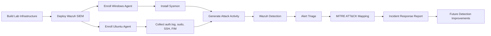
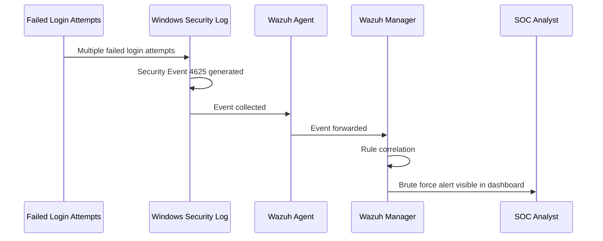
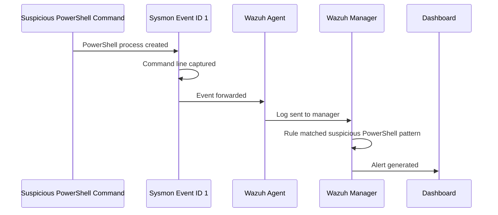
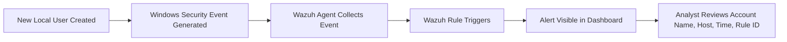
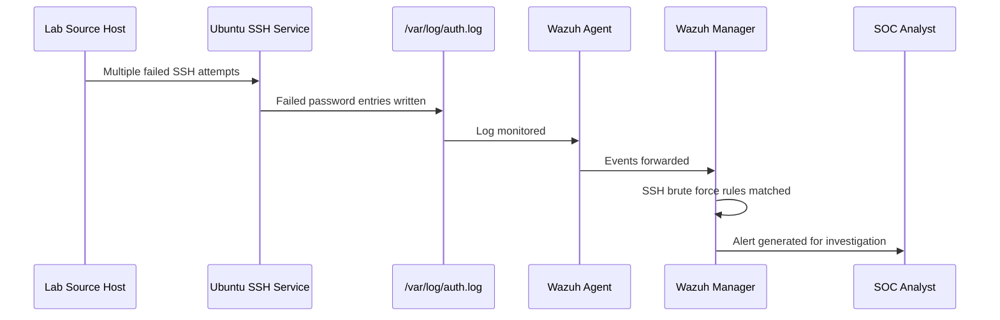
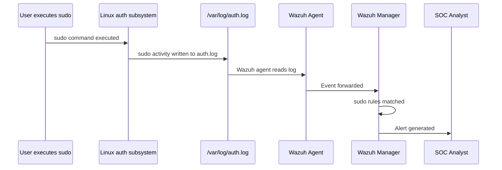
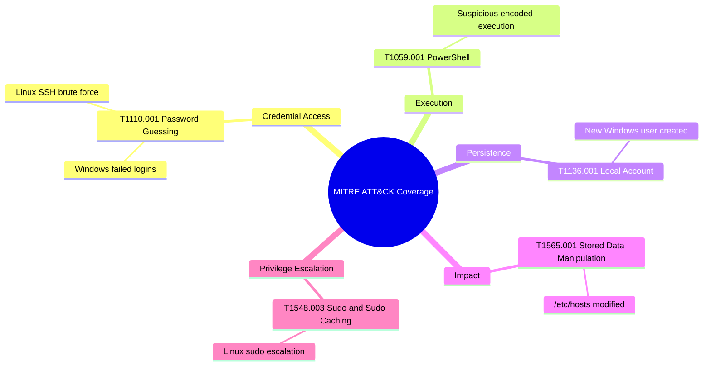
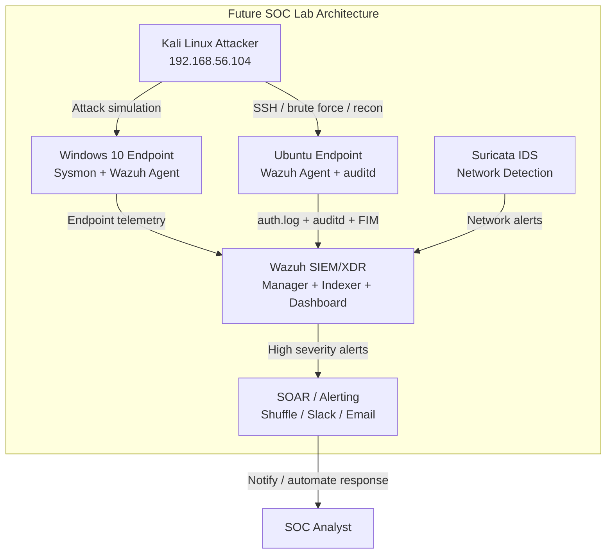

<div align="center">

# Enterprise SOC Lab

### Wazuh SIEM | MITRE ATT&CK | Windows Sysmon | Linux Detection | Incident Response

<br/>

[](https://git.io/typing-svg)

<br/>


<br/><br/>


<br/><br/>

<h3>Real endpoint activity. Real Wazuh alerts. Real analyst workflow.</h3>

<b>This project demonstrates the complete SOC process:</b>

<br/><br/>

<code>Build → Configure → Generate Logs → Detect → Investigate → Map to MITRE → Report → Improve</code>

</div>

---

---

## Table of Contents

* [Project Overview](#project-overview)
* [Why I Built This Lab](#why-i-built-this-lab)
* [SOC Workflow Demonstrated](#soc-workflow-demonstrated)
* [Lab Architecture](#lab-architecture)
* [Technology Stack](#technology-stack)
* [Network Design](#network-design)
* [Detection Summary](#detection-summary)
* [Attack Simulations](#attack-simulations)
* [MITRE ATT&CK Mapping](#mitre-attck-mapping)
* [Incident Response Reports](#incident-response-reports)
* [Detection Engineering](#detection-engineering)
* [Vulnerability Detection](#vulnerability-detection)
* [Evidence Gallery](#evidence-gallery)
* [Skills Demonstrated](#skills-demonstrated)
* [Problems Solved During the Lab](#problems-solved-during-the-lab)
* [Future Improvements](#future-improvements)
* [How to Reproduce This Lab](#how-to-reproduce-this-lab)
* [Ethical Notice](#ethical-notice)

---

# Project Overview

This repository contains a fully documented **Enterprise SOC Lab** built using **Wazuh SIEM/XDR**, Windows endpoint telemetry, Linux log monitoring, File Integrity Monitoring, vulnerability detection, custom rule preparation, MITRE ATT&CK mapping, and incident response reporting.

The goal was to simulate how a SOC analyst investigates security events in a real environment.

This was not a simple dashboard screenshot project. The lab was built from scratch using virtual machines, agents, endpoint logs, Sysmon, Linux authentication logs, Wazuh alerts, MITRE ATT&CK mapping, and formal IR documentation.

---

## What this project proves

This project demonstrates that I can:

* Build a working SIEM lab from scratch.
* Deploy and manage Wazuh manager, indexer, dashboard, and agents.
* Configure Windows and Linux endpoints for security monitoring.
* Collect logs from Windows Security Events, Sysmon, PowerShell, Linux `auth.log`, sudo logs, SSH logs, and File Integrity Monitoring.
* Simulate real attack behaviors in a controlled lab.
* Detect malicious or suspicious activity using Wazuh alerts.
* Investigate alert details like source host, rule ID, severity, event data, process command line, and MITRE technique.
* Map detections to MITRE ATT&CK.
* Write professional incident response reports.
* Identify gaps and document future improvements.

---

# Why I Built This Lab

I built this project to practice the real responsibilities of a SOC Analyst / Cybersecurity Analyst:

| SOC Responsibility     | How this lab demonstrates it                                                 |
| ---------------------- | ---------------------------------------------------------------------------- |
| SIEM monitoring        | Wazuh dashboard used for real alert investigation                            |
| Endpoint visibility    | Windows 10 + Sysmon and Ubuntu 22.04 monitored with Wazuh agents             |
| Alert triage           | Every alert was reviewed with severity, rule ID, host, and event details     |
| Threat detection       | Brute force, PowerShell, user creation, SSH, FIM, and sudo activity detected |
| MITRE mapping          | Each detection mapped to a specific MITRE ATT&CK technique                   |
| Incident documentation | 6 incident reports and 1 full triage report created                          |
| Detection engineering  | Custom Wazuh XML rules prepared for future detection expansion               |
| Continuous improvement | Future roadmap created with Kali, auditd, Active Response, and alerting      |

---

# SOC Workflow Demonstrated



---

# Lab Architecture

<div align="center">


</div>

---

## Network Diagram

<div align="center">


</div>

zuh --> Dashboard["Wazuh Dashboard<br/>Alert Triage + MITRE Mapping"]
```

---

# Technology Stack

| Category                | Tool / Technology                                    | Purpose                                                      |
| ----------------------- | ---------------------------------------------------- | ------------------------------------------------------------ |
| SIEM / XDR              | Wazuh 4.7.5                                          | Centralized detection, alerting, log analysis, MITRE mapping |
| Dashboard               | Wazuh Dashboard / OpenSearch                         | Visual investigation and alert review                        |
| Endpoint 1              | Windows 10 Pro                                       | Windows attack simulation and event collection               |
| Endpoint 2              | Ubuntu 22.04.5 LTS                                   | Linux SSH, sudo, auth log, and FIM monitoring                |
| Endpoint Telemetry      | Sysmon                                               | Deep Windows process-level visibility                        |
| Log Sources             | Windows Security, Sysmon, PowerShell, Linux auth.log | Alert generation and investigation                           |
| FIM                     | Wazuh Syscheck                                       | File integrity monitoring for sensitive files                |
| Vulnerability Detection | Wazuh Vulnerability Detector                         | CVE visibility for monitored endpoints                       |
| Rules                   | Wazuh XML rules                                      | Built-in detection and custom rule preparation               |
| Framework               | MITRE ATT&CK Enterprise                              | Threat behavior mapping                                      |
| Virtualization          | VirtualBox                                           | Isolated lab environment                                     |
| Documentation           | Markdown + PDF Reports                               | Portfolio-ready reporting and evidence                       |

---

# Detection Summary

<div align="center">

|  # | Scenario                         | Platform | Log Source               | Wazuh Detection                        | MITRE Technique | Status   |
| -: | -------------------------------- | -------- | ------------------------ | -------------------------------------- | --------------- | -------- |
| 01 | Windows failed login brute force | Windows  | Security Event Log       | Failed authentication alerts           | T1110.001       | Detected |
| 02 | Suspicious PowerShell execution  | Windows  | Sysmon + PowerShell logs | Encoded command / suspicious execution | T1059.001       | Detected |
| 03 | New local user creation          | Windows  | Security Event Log       | Account creation alert                 | T1136.001       | Detected |
| 04 | Linux SSH brute force            | Ubuntu   | `/var/log/auth.log`      | SSH authentication failure alerts      | T1110.001       | Detected |
| 05 | `/etc/hosts` file modification   | Ubuntu   | Wazuh FIM / Syscheck     | File checksum changed                  | T1565.001       | Detected |
| 06 | sudo privilege escalation        | Ubuntu   | `/var/log/auth.log`      | Successful and failed sudo alerts      | T1548.003       | Detected |

</div>

---

---

# Attack Simulations

The attack simulations were performed inside the isolated lab environment only. The goal was not exploitation, but **log generation, detection validation, alert triage, and reporting**.

---

## Scenario 01 — Windows Brute Force / Failed Login Attempts

### Objective

Simulate repeated failed Windows login attempts and validate that Wazuh detects authentication failures from the Windows Security Event Log.

### Attack Behavior

Repeated failed login attempts were generated against the Windows 10 endpoint.

### Log Source

| Field           | Value                                         |
| --------------- | --------------------------------------------- |
| Endpoint        | Windows 10 Pro                                |
| Log Source      | Windows Security Event Log                    |
| Event Type      | Failed logon attempt                          |
| Common Event ID | `4625`                                        |
| Detection Type  | Authentication failure / brute force behavior |

### Detection Chain



### Analyst Notes

This alert is important because repeated failed logins may indicate password guessing, credential stuffing, or unauthorized access attempts. In a production environment, the next step would be to identify the source IP, targeted account, failure frequency, and whether any successful login occurred after the failures.

### Evidence


---

## Scenario 02 — Suspicious PowerShell Execution

### Objective

Simulate suspicious PowerShell execution and confirm that Wazuh can detect PowerShell activity through Windows telemetry and Sysmon.

### Attack Behavior

PowerShell was executed with suspicious command-line behavior commonly associated with attacker activity, such as encoded execution and bypass-style flags.

### Why this matters

PowerShell is frequently abused because it is already present on Windows systems and can be used for execution, defense evasion, payload staging, and post-exploitation activity.

### Log Source

| Field                  | Value                                                             |
| ---------------------- | ----------------------------------------------------------------- |
| Endpoint               | Windows 10 Pro                                                    |
| Telemetry              | Sysmon                                                            |
| Important Sysmon Event | Event ID 1 — Process Creation                                     |
| Detection Focus        | Process command line, parent process, suspicious PowerShell flags |
| MITRE Mapping          | T1059.001 — PowerShell                                            |

### Detection Chain



### Analyst Notes

Sysmon is one of the most valuable parts of this project. Without Sysmon, Windows may show that a process executed, but Sysmon gives deeper visibility such as:

* Process image
* Command line
* Parent process
* Process ID
* Hashes
* Execution context

This makes PowerShell investigation much stronger.

### Evidence


---

## Scenario 03 — New Local User Creation

### Objective

Detect creation of a new local Windows user account.

### Attack Behavior

A new local user account was created on the Windows endpoint.

### Why this matters

Attackers often create new local accounts after gaining access so they can maintain persistence even if the original access method is removed.

### Log Source

| Field           | Value                                     |
| --------------- | ----------------------------------------- |
| Endpoint        | Windows 10 Pro                            |
| Log Source      | Windows Security Event Log                |
| Common Event ID | `4720`                                    |
| Detection Type  | Local account creation                    |
| MITRE Mapping   | T1136.001 — Create Account: Local Account |

### Detection Chain



### Analyst Notes

In a real SOC, this alert would require checking:

* Was the account created by an administrator?
* Was the account created during approved change activity?
* Is the account name suspicious?
* Was the account added to privileged groups?
* Did the account log in after creation?
* Is this activity linked to earlier brute force or PowerShell activity?

### Evidence


---

## Scenario 04 — Linux SSH Brute Force

### Objective

Simulate repeated SSH login failures against the Ubuntu endpoint and confirm that Wazuh detects SSH brute force behavior.

### Attack Behavior

Multiple failed SSH authentication attempts were generated against the Ubuntu machine from another system inside the lab network.

### Log Source

| Field          | Value                         |
| -------------- | ----------------------------- |
| Endpoint       | Ubuntu 22.04.5                |
| Log Source     | `/var/log/auth.log`           |
| Service        | SSH                           |
| Detection Type | Failed SSH authentication     |
| MITRE Mapping  | T1110.001 — Password Guessing |

### Detection Chain



### Analyst Notes

Linux SSH brute force alerts are high-value because SSH is a common remote access service. During triage, an analyst should review:

* Source IP address
* Target username
* Number of failures
* Time window
* Whether a successful login followed
* Whether the source is internal or external
* Whether the targeted account exists

### Evidence


---

## Scenario 05 — File Integrity Monitoring: `/etc/hosts` Modified

### Objective

Detect unauthorized modification of the Linux `/etc/hosts` file using Wazuh File Integrity Monitoring.

### Attack Behavior

The `/etc/hosts` file was modified on the Ubuntu endpoint.

### Why this matters

The `/etc/hosts` file can override DNS resolution locally. If an attacker modifies it, they may redirect traffic from legitimate domains to malicious infrastructure.

### Log Source

| Field          | Value                                |
| -------------- | ------------------------------------ |
| Endpoint       | Ubuntu 22.04.5                       |
| Feature        | Wazuh File Integrity Monitoring      |
| File Monitored | `/etc/hosts`                         |
| Detection Type | File checksum changed                |
| MITRE Mapping  | T1565.001 — Stored Data Manipulation |

### Detection Chain

```mermaid
flowchart TB
    A[/etc/hosts file modified] --> B[Wazuh Syscheck detects file change]
    B --> C[Checksum comparison changed]
    C --> D[Wazuh FIM alert generated]
    D --> E[Analyst reviews file path, timestamp, old hash, new hash]
    E --> F[Incident report created]
```

### Analyst Notes

File Integrity Monitoring is important because attackers often modify configuration files to:

* Redirect traffic
* Hide persistence
* Change service behavior
* Modify access controls
* Tamper with system configuration

For this alert, the correct response would be to verify the change, compare the file against a trusted baseline, restore the original file if unauthorized, and investigate which user or process made the change.

### Evidence


---

## Scenario 06 — Linux Sudo Privilege Escalation

### Objective

Detect suspicious sudo activity, including successful privilege escalation and failed sudo attempts.

### Attack Behavior

Sudo commands were executed on the Ubuntu endpoint to simulate privilege escalation behavior.

### Why this matters

Attackers who gain access as a low-privileged Linux user often attempt to escalate privileges using sudo, misconfigurations, cached credentials, or weak administrative controls.

### Log Source

| Field          | Value                             |
| -------------- | --------------------------------- |
| Endpoint       | Ubuntu 22.04.5                    |
| Log Source     | `/var/log/auth.log`               |
| Detection Type | sudo usage / failed sudo attempts |
| MITRE Mapping  | T1548.003 — Sudo and Sudo Caching |

### Detection Chain



### Analyst Notes

Sudo alerts should be reviewed carefully because they may represent either legitimate administrative activity or privilege escalation attempts. Important details include:

* User who executed sudo
* Command executed
* Whether authentication succeeded or failed
* Number of failed attempts
* Time of execution
* Whether the activity was expected
* Whether it followed another suspicious event

### Evidence


---

# MITRE ATT&CK Mapping

<div align="center">

| Scenario                  | MITRE ID  | Technique                | Tactic               | Platform |
| ------------------------- | --------- | ------------------------ | -------------------- | -------- |
| Windows Brute Force       | T1110.001 | Password Guessing        | Credential Access    | Windows  |
| Suspicious PowerShell     | T1059.001 | PowerShell               | Execution            | Windows  |
| New Local User            | T1136.001 | Local Account            | Persistence          | Windows  |
| Linux SSH Brute Force     | T1110.001 | Password Guessing        | Credential Access    | Linux    |
| `/etc/hosts` Modified     | T1565.001 | Stored Data Manipulation | Impact               | Linux    |
| Sudo Privilege Escalation | T1548.003 | Sudo and Sudo Caching    | Privilege Escalation | Linux    |

</div>

---

## MITRE Coverage View



---

## MITRE Evidence Screenshots


---

# Incident Response Reports

This project includes six individual incident response reports and one full triage report.

| Report ID        | Incident                                         | Platform        | Severity | MITRE     | Report                                                                    |
| ---------------- | ------------------------------------------------ | --------------- | -------- | --------- | ------------------------------------------------------------------------- |
| IR-001           | Windows Brute Force Failed Logins                | Windows         | High     | T1110.001 | [View PDF](./Reports/IR-001-Windows-Brute-Force-Failed-Logins.pdf)        |
| IR-002           | Suspicious PowerShell Execution                  | Windows         | High     | T1059.001 | [View PDF](./Reports/IR-002-Suspicious-PowerShell-Execution.pdf)          |
| IR-003           | New Local User Creation                          | Windows         | Medium   | T1136.001 | [View PDF](./Reports/IR-003-New-Local-User-Creation-Windows.pdf)          |
| IR-004           | Linux SSH Brute Force                            | Linux           | High     | T1110.001 | [View PDF](./Reports/IR-004-Linux-SSH-Brute-Force.pdf)                    |
| IR-005           | File Integrity Monitoring: `/etc/hosts` Modified | Linux           | Medium   | T1565.001 | [View PDF](./Reports/IR-005-File-Integrity-Monitoring-Hosts-Modified.pdf) |
| IR-006           | Linux Sudo Privilege Escalation                  | Linux           | High     | T1548.003 | [View PDF](./Reports/IR-006-Linux-Sudo-Privilege-Escalation.pdf)          |
| Full Report      | SOC Lab Full Triage Report                       | Windows + Linux | Mixed    | Multiple  | [View PDF](./Reports/SOC-Lab-Full-Triage-Report.pdf)                      |
| Improvement Plan | Future SOC Lab Improvement Document              | Windows + Linux | N/A      | N/A       | [View PDF](./Reports/Improvement-doc.pdf)                                 |

---

## Incident Report Structure

Each incident report follows a SOC-style format:

```text
1. Executive Summary
2. Detection Overview
3. Affected Host
4. Log Source
5. Wazuh Rule Details
6. MITRE ATT&CK Mapping
7. Timeline of Events
8. Evidence Collected
9. Impact Assessment
10. Containment Recommendations
11. Remediation Steps
12. Lessons Learned
```

---

# Detection Engineering

This lab uses a combination of Wazuh built-in rules, endpoint telemetry, and prepared custom rules.

---

## Confirmed Detection Sources

| Detection Area               | Source                       | Status                           |
| ---------------------------- | ---------------------------- | -------------------------------- |
| Windows failed logins        | Windows Security Events      | Confirmed                        |
| PowerShell process execution | Sysmon + Windows logs        | Confirmed                        |
| New local user account       | Windows Security Events      | Confirmed                        |
| SSH brute force              | Linux `/var/log/auth.log`    | Confirmed                        |
| File modification            | Wazuh FIM / Syscheck         | Confirmed                        |
| sudo activity                | Linux `/var/log/auth.log`    | Confirmed                        |
| Vulnerability data           | Wazuh Vulnerability Detector | Confirmed                        |
| Custom rule examples         | `Rules/custom-rules.xml`     | Prepared for deployment / tuning |

---

## Built-in Wazuh Rule Examples Observed

| Rule ID | Detection                                 | Platform | Purpose                                       |
| ------: | ----------------------------------------- | -------- | --------------------------------------------- |
|    5710 | SSH login attempt using non-existent user | Linux    | Detect invalid SSH usernames                  |
|    2502 | User missed password more than once       | Linux    | Detect repeated authentication failures       |
|    5402 | Successful sudo to ROOT                   | Linux    | Detect privilege escalation activity          |
|    5404 | Multiple failed sudo attempts             | Linux    | Detect suspicious sudo failures               |
|     550 | Integrity checksum changed                | Linux    | Detect file integrity changes                 |
|   92057 | PowerShell encoded command pattern        | Windows  | Detect suspicious PowerShell execution        |
|   92027 | PowerShell process relationship           | Windows  | Detect suspicious PowerShell process behavior |

---

## Custom Rule File

Custom rule examples are included in:

```text
Rules/custom-rules.xml
```

These rules are prepared for future detection engineering and tuning.

```xml
<!--
Custom rules are planned improvements for this lab.
These rules should be validated after adding them to Wazuh,
restarting the manager, and capturing alerts with custom rule IDs.
-->

<group name="local,linux,reverse_shell,">
  <rule id="100001" level="12">
    <if_group>syslog</if_group>
    <match>nc -e|nc -lvp|/bin/bash -i</match>
    <description>Possible reverse shell - netcat or interactive shell pattern</description>
    <mitre>
      <id>T1059</id>
    </mitre>
  </rule>
</group>

<group name="local,windows,powershell,">
  <rule id="100002" level="12">
    <if_group>windows,powershell,</if_group>
    <match>-EncodedCommand|-enc</match>
    <description>PowerShell encoded command execution detected</description>
    <mitre>
      <id>T1059.001</id>
    </mitre>
  </rule>
</group>
```

---

## How the Custom Rules Would Be Deployed

```bash
# On the Wazuh manager
sudo cp Rules/custom-rules.xml /var/ossec/etc/rules/local_rules.xml

# Validate rules
sudo /var/ossec/bin/wazuh-logtest

# Restart Wazuh manager
sudo systemctl restart wazuh-manager

# Confirm manager status
sudo systemctl status wazuh-manager
```

---

# Vulnerability Detection

Wazuh vulnerability detection was enabled and reviewed for both monitored endpoints.

| Endpoint              | Status                      |
| --------------------- | --------------------------- |
| Windows 10 endpoint   | Vulnerability scan reviewed |
| Ubuntu 22.04 endpoint | Vulnerability scan reviewed |

## Evidence


---

# Evidence Gallery

## Wazuh Dashboard


---

## Agents Connected


---

## Windows Endpoint Evidence


---

## Ubuntu Endpoint Evidence


---

## Wazuh Server Evidence


---

# Skills Demonstrated

## SOC Analyst Skills

| Skill                     | Evidence in Project                                |
| ------------------------- | -------------------------------------------------- |
| SIEM deployment           | Wazuh all-in-one server deployed                   |
| Endpoint onboarding       | Windows and Ubuntu agents connected                |
| Windows log analysis      | Security events and Sysmon reviewed                |
| Linux log analysis        | `/var/log/auth.log`, SSH, and sudo events reviewed |
| Alert triage              | Wazuh alerts investigated and documented           |
| MITRE ATT&CK mapping      | Every attack scenario mapped to ATT&CK             |
| Incident response         | Six IR reports written                             |
| File integrity monitoring | `/etc/hosts` modification detected                 |
| Vulnerability management  | Wazuh vulnerability dashboard reviewed             |
| Detection engineering     | Custom Wazuh XML rules prepared                    |
| Documentation             | Professional README and PDF reports created        |

---

## Technical Skills

* Wazuh SIEM/XDR deployment
* Wazuh agent installation
* Windows event monitoring
* Sysmon installation and verification
* Linux authentication log monitoring
* SSH brute force detection
* sudo activity detection
* File Integrity Monitoring
* Vulnerability Detection
* MITRE ATT&CK mapping
* XML-based Wazuh rule writing
* Incident response reporting
* Network troubleshooting
* VirtualBox lab design
* Evidence collection and documentation

---

# Problems Solved During the Lab

This lab also documents real troubleshooting work, which is important because SOC environments are rarely perfect.

| Problem                         | Resolution / Learning                                                           |
| ------------------------------- | ------------------------------------------------------------------------------- |
| Agent connectivity issues       | Verified IP addressing and ping connectivity between Wazuh server and endpoints |
| Sysmon visibility               | Installed and verified Sysmon logs in Windows Event Viewer                      |
| Ubuntu agent version difference | Identified version mismatch and documented it                                   |
| Vulnerability scan error        | Captured and documented NVD database scan error                                 |
| FIM error during attack 5       | Troubleshot and captured corrected alert                                        |
| Network verification            | Confirmed host-to-host connectivity across lab systems                          |
| Dashboard visibility            | Verified alerts inside Wazuh dashboard                                          |

---

# Future Improvements

The next phase of this lab will focus on making the environment closer to a real enterprise SOC with offensive simulation, better telemetry, automated response, and advanced correlation.

## Planned Enhancements

| Priority | Improvement                                    | Expected Value                                                   |
| -------- | ---------------------------------------------- | ---------------------------------------------------------------- |
| High     | Add Kali Linux attacker VM                     | More realistic attack simulation using dedicated attacker system |
| High     | Enable Wazuh Active Response                   | Automatically block brute force source IPs                       |
| High     | Add Windows Sysmon custom configuration tuning | Improve Windows endpoint visibility                              |
| Medium   | Deploy auditd on Ubuntu                        | Capture deeper Linux syscall-level activity                      |
| Medium   | Add Suricata IDS                               | Add network-based detection layer                                |
| Medium   | Add TheHive or Shuffle SOAR                    | Improve case management and automation                           |
| Medium   | Add email or Slack alerting                    | Simulate real SOC notification workflow                          |
| Medium   | Expand custom Wazuh rules                      | Detect reverse shells, suspicious bash, PowerShell, persistence  |
| Low      | Export raw alert JSON                          | Better forensic evidence collection                              |
| Low      | Add Atomic Red Team tests                      | Repeatable MITRE-mapped test cases                               |

---

## Future Architecture

<div align="center">


</div>



---

# How to Reproduce This Lab

> Only perform these steps in your own isolated lab environment.

## 1. Create Virtual Machines

| VM                  | Suggested Specs                |
| ------------------- | ------------------------------ |
| Wazuh Server        | 2 vCPU, 4 GB RAM, 50 GB disk   |
| Windows 10 Endpoint | 2 vCPU, 2–4 GB RAM, 40 GB disk |
| Ubuntu Endpoint     | 1–2 vCPU, 2 GB RAM, 20 GB disk |

---

## 2. Configure Isolated Network

Use a host-only network such as:

```text
Network: 192.168.56.0/24
Wazuh Server: 192.168.56.102
Windows Endpoint: 192.168.56.101
Ubuntu Endpoint: 192.168.56.103
```

Verify connectivity:

```bash
ping 192.168.56.101
ping 192.168.56.102
ping 192.168.56.103
```

---

## 3. Install Wazuh Server

Install Wazuh all-in-one on the Ubuntu server VM.

After installation, confirm:

```bash
sudo systemctl status wazuh-manager
sudo systemctl status wazuh-indexer
sudo systemctl status wazuh-dashboard
```

Access the dashboard:

```text
https://192.168.56.102
```

---

## 4. Install Windows Agent

From the Wazuh dashboard:

```text
Agents → Deploy new agent → Windows
```

Use the Wazuh server IP:

```text
192.168.56.102
```

Verify the Windows Wazuh service:

```powershell
Get-Service WazuhSvc
```

---

## 5. Install Sysmon on Windows

Sysmon was installed to collect deeper process telemetry.

Verify Sysmon:

```powershell
Get-Service Sysmon64

Get-WinEvent -LogName "Microsoft-Windows-Sysmon/Operational" -MaxEvents 5
```

---

## 6. Install Ubuntu Agent

Install and configure the Wazuh agent on Ubuntu.

Verify:

```bash
sudo systemctl status wazuh-agent
```

Check Linux authentication logs:

```bash
sudo tail -f /var/log/auth.log
```

---

## 7. Enable File Integrity Monitoring

Confirm that Wazuh FIM / Syscheck is monitoring important Linux files such as:

```text
/etc/hosts
/etc/passwd
/etc/shadow
/etc/sudoers
```

---

## 8. Generate Lab Activity

Generate controlled activity for:

* Windows failed logins
* PowerShell execution
* Windows local user creation
* Linux SSH failures
* Linux file modification
* Linux sudo activity

Then review alerts in:

```text
Wazuh Dashboard → Security Events
```

---

# Key Lessons Learned

## 1. Visibility depends on log quality

The SIEM can only detect what it receives. Adding Sysmon improved Windows visibility significantly.

## 2. Linux logs are extremely valuable

`/var/log/auth.log` provides useful evidence for SSH activity, sudo usage, failed authentication, and privilege escalation.

## 3. MITRE ATT&CK improves communication

Mapping each alert to MITRE ATT&CK makes it easier to explain attacker behavior in professional terms.

## 4. Detection is only half the job

A SOC analyst must also document what happened, why it matters, what evidence supports the finding, and what should be done next.

## 5. Troubleshooting is part of cybersecurity

Agent issues, version mismatches, log visibility problems, and dashboard errors are realistic parts of SOC engineering work.

---


# Repository Structure

```text
enterprise-soc-lab-wazuh-mitre-detection/
│
├── README.md
│
├── architecture/
│   ├── Lab.png
│   └── Network.png
│
├── screenshots/
│   ├── Wazuh-dashboard
│   ├── agents-connected
│   ├── brute-force-alert
│   ├── powershell-alert
│   ├── new-user-alert
│   ├── linux-ssh-brute-force-alert
│   ├── fim-alert
│   ├── sudo-privilege-escalation-alert
│   ├── mitre-dashboard
│   ├── future-network-diagram.png
│   └── additional setup and evidence screenshots
│
├── Reports/
│   ├── IR-001-Windows-Brute-Force-Failed-Logins.pdf
│   ├── IR-002-Suspicious-PowerShell-Execution.pdf
│   ├── IR-003-New-Local-User-Creation-Windows.pdf
│   ├── IR-004-Linux-SSH-Brute-Force.pdf
│   ├── IR-005-File-Integrity-Monitoring-Hosts-Modified.pdf
│   ├── IR-006-Linux-Sudo-Privilege-Escalation.pdf
│   ├── SOC-Lab-Full-Triage-Report.pdf
│   └── Improvement-doc.pdf
│
└── Rules/
    └── custom-rules.xml
```

---

# Ethical Notice

This project was created only for cybersecurity learning and portfolio demonstration.

All simulations were performed inside a self-owned isolated virtual lab. No real external systems, public IP addresses, corporate networks, or third-party assets were targeted.

The purpose of this project is defensive security training, SOC analysis, incident response practice, and detection engineering.

---

<div align="center">


### Built. Detected. Investigated. Documented.


</div>
