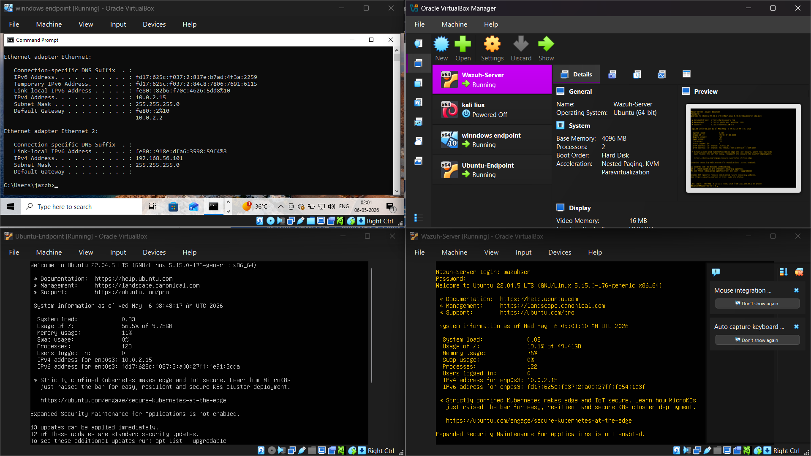
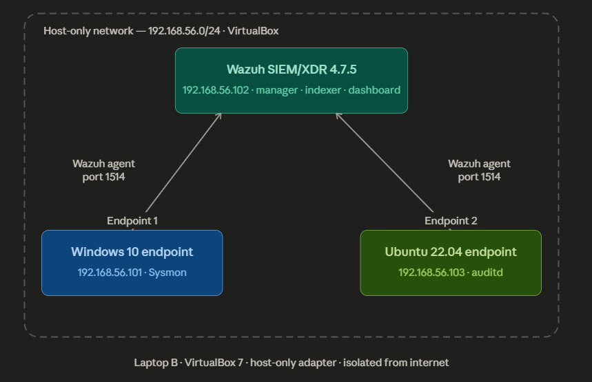
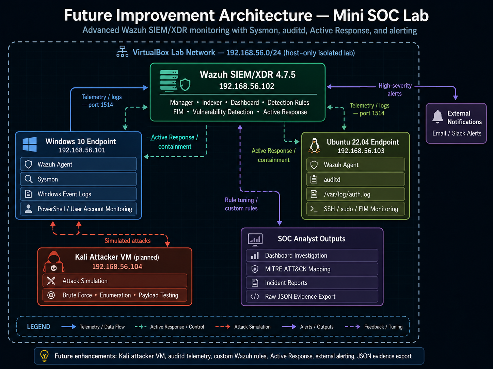

# enterprise-soc-lab-wazuh-mitre-detection
Mini enterprise SOC lab using Wazuh SIEM/XDR with Windows and Linux endpoints, MITRE ATT&amp;CK mapping, vulnerability detection, and incident reports.


# Enterprise SOC Lab — Wazuh SIEM/XDR with MITRE ATT&CK Detection

## Table of Contents
- [Overview](#overview)
- [Lab Architecture](#lab-architecture)
- [How to Reproduce This Lab](#How-to-Reproduce-This-Lab)
- [Attack Simulations](#attack-simulations)
- [Detections and MITRE ATT&CK Mapping](#detections-and-mitre-attck-mapping)
- [Incident Reports](#incident-reports)
- [Full SOC Triage Report](#full-soc-triage-report)
- [Detection Rules](#detection-rules)
- [Screenshots](#screenshots)
- [Key Skills Demonstrated](#key-skills-demonstrated)
- [Lessons Learned](#lessons-learned)
- [Future Improvements](#future-improvements)
- [Planned Future Architecture](#Planned-Future-Architecture)
- [Resume Bullet](#resume-bullet)

## Overview
This project is a mini enterprise SOC lab built using Wazuh SIEM/XDR. The lab simulates, detects, and investigates real-world attack techniques across Windows and Linux endpoints.

The environment includes a Wazuh 4.7.5 all-in-one server, a Windows 10 endpoint with Sysmon, and an Ubuntu 22.04.5 endpoint. The project demonstrates log collection, alert triage, MITRE ATT&CK mapping, File Integrity Monitoring, vulnerability detection, and formal incident report writing.

## Lab Architecture

Lab Screenshot



### Lab Network Diagram




| Component | Tool / OS | Role | IP Address |
|---|---|---|---|
| SIEM/XDR | Wazuh 4.7.5 | Manager, Dashboard, Indexer, alerting, FIM | 192.168.56.102 |
| Endpoint 1 | Windows 10 + Sysmon | Windows logs, process monitoring, PowerShell detection | 192.168.56.101 |
| Endpoint 2 | Ubuntu 22.04.5 | Linux auth logs, SSH monitoring, sudo monitoring, FIM | 192.168.56.103 |
| Virtualisation | VirtualBox | Host-only lab network | 192.168.56.0/24 |

## How to Reproduce This Lab

### Prerequisites
- VirtualBox 7.x (free)
- Minimum 8GB RAM host machine (16GB recommended)
- ~80GB free disk space

### Step 1 — Deploy Wazuh Server
1. Download Ubuntu 22.04 Server ISO
2. Create VM: 4GB RAM, 2 CPU, 50GB disk, Host-Only network adapter
3. Run the Wazuh all-in-one installer:
```bash
curl -sO https://packages.wazuh.com/4.7/wazuh-install.sh
sudo bash wazuh-install.sh -a
```
4. Access dashboard at `https://192.168.56.102` (default user: admin)

### Step 2 — Deploy Windows Agent
1. Create Windows 10 VM: 2GB RAM, Host-Only adapter, static IP 192.168.56.101
2. Download Wazuh Windows agent from the dashboard (Agents > Deploy new agent)
3. Install Sysmon: download from Sysinternals, run:
```powershell
sysmon64.exe -accepteula -i sysmonconfig.xml
```

### Step 3 — Deploy Linux Agent
1. Create Ubuntu 22.04 VM: 1GB RAM, Host-Only adapter, static IP 192.168.56.103
2. Install Wazuh agent:
```bash
curl -sO https://packages.wazuh.com/4.7/wazuh-agent-install.sh
sudo WAZUH_MANAGER='192.168.56.102' bash wazuh-agent-install.sh
sudo systemctl enable wazuh-agent && sudo systemctl start wazuh-agent
```


## Attack Simulations

| # | Attack / Detection | Platform | Status |
|---|---|---|---|
| 1 | Brute force failed logins | Windows | Completed |
| 2 | Suspicious PowerShell execution | Windows | Completed |
| 3 | New local user creation | Windows | Completed |
| 4 | SSH brute force | Linux | Completed |
| 5 | File Integrity Monitoring — `/etc/hosts` modified | Linux | Completed |
| 6 | Privilege escalation using sudo | Linux | Completed |


## Detections and MITRE ATT&CK Mapping

| Detection | Log Source | MITRE ID | Technique | Tactic | Severity |
|---|---|---|---|---|---|
| Windows failed logins | Windows Security Log | T1110.001 | Brute Force: Password Guessing | Credential Access | High |
| Suspicious PowerShell execution | Sysmon / Windows Event Logs | T1059.001 | Command and Scripting Interpreter: PowerShell | Execution / Defense Evasion | High |
| New local user created | Windows Security Log | T1136.001 | Create Account: Local Account | Persistence | Medium |
| SSH brute force | Linux `/var/log/auth.log` | T1110.001 | Brute Force: Password Guessing | Credential Access | High |
| File `/etc/hosts` modified | Wazuh FIM / Syscheck | T1565.001 | Stored Data Manipulation | Impact | Medium |
| Sudo privilege escalation | Linux `/var/log/auth.log` | T1548.003 | Sudo and Sudo Caching | Privilege Escalation | High |
| Vulnerability detection | Wazuh Vulnerability Detector | N/A | CVE exposure / vulnerability management | Risk Management | High |
## Screenshots
### Wazuh Dashboard


### Both Agents Active


### Brute Force Alert


### Suspicious PowerShell Execution


### New Local User Creation


### Linux SSH Brute Force


### File Integrity Monitoring


### Linux Sudo Privilege Escalation


### MITRE ATT&CK Dashboard


### Vulnerability Detection 


## Incident Reports

- [IR-001: Windows Brute Force Failed Logins](Reports/IR-001-Windows-Brute-Force-Failed-Logins.pdf)
- [IR-002: Suspicious PowerShell Execution](Reports/IR-002-Suspicious-PowerShell-Execution.pdf)
- [IR-003: New Local User Creation — Windows](Reports/IR-003-New-Local-User-Creation-Windows.pdf)
- [IR-004: Linux SSH Brute Force](Reports/IR-004-Linux-SSH-Brute-Force.pdf)
- [IR-005: File Integrity Monitoring — Hosts File Modified](Reports/IR-005-File-Integrity-Monitoring-Hosts-Modified.pdf)
- [IR-006: Linux Sudo Privilege Escalation](Reports/IR-006-Linux-Sudo-Privilege-Escalation.pdf)

## Full SOC Triage Report

- [Full SOC Triage Report](Reports/SOC-Lab-Full-Triage-Report.pdf)

## Detection Rules

This lab relied on Wazuh built-in rules for detections. Custom rule examples demonstrating additional detection logic are provided in the Rules/ folder.

- [Custom Rules XML](Rules/custom-rules.xml)

Confirmed built-in rules included:

| Rule ID | Description | Area |
|---|---|---|
| 92057 | PowerShell encoded command | Windows suspicious execution |
| 92027 | PowerShell process spawned PowerShell instance | Windows process behavior |
| 5710 | SSH login using non-existent user | Linux SSH authentication |
| 2502 | User missed the password more than one time | Linux authentication failure |
| 5402 | Successful sudo to ROOT executed | Linux sudo monitoring |
| 5404 | Three failed attempts to run sudo | Linux sudo failed attempts |
| 550 | Integrity checksum changed | FIM / Syscheck |

## Key Skills Demonstrated

This project demonstrates end-to-end SOC operations in a lab environment: deploying Wazuh SIEM/XDR, configuring Windows (Sysmon) and Linux agents, simulating 6 attack scenarios, triaging alerts, mapping detections to MITRE ATT&CK, and writing formal incident reports — the same workflow a junior SOC analyst performs daily.

## Lessons Learned

1. I learned how a SIEM collects logs from multiple endpoints and turns raw events into useful security alerts.
2. I learned how Windows Sysmon improves visibility into process creation and suspicious PowerShell activity.
3. I learned how Linux authentication logs reveal SSH brute-force attempts and sudo privilege escalation behavior.
4. I learned how MITRE ATT&CK helps explain attacker behavior in a structured way.
5. I learned that documentation is a major part of SOC work because an analyst must explain what happened, why it matters, and how to respond.

## Future Improvements

- Add a dedicated Kali attacker VM.
- Fully implement and test custom Wazuh rules with custom rule IDs.
- Enable Wazuh Active Response to automatically block brute-force source IPs.
- Add Slack or email alerting for high-severity alerts.
- Export raw JSON evidence for important alerts.

  # Planned Future Architecture

This diagram shows the planned improved version of the lab, where the Ubuntu endpoint will include auditd for deeper Linux monitoring.


  
  
-[How to Improve the Current Mini SOC Lab.pdf](Reports/Improvement-Document)


## Resume Bullet

Built a mini enterprise SOC lab using Wazuh SIEM/XDR with Windows Sysmon and Ubuntu Linux endpoints. Configured log collection, simulated 6 attack scenarios, mapped detections to the MITRE ATT&CK framework, enabled FIM and vulnerability detection, and documented formal incident investigation reports.
